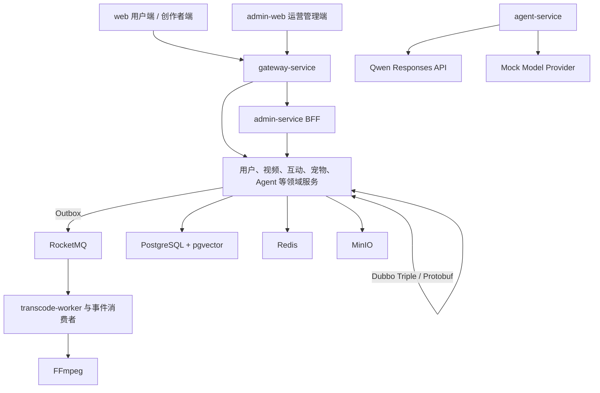

# Streamora 系统架构

```yaml
version: 1
updatedAt: 2026-08-15
status: approved-design
implementationStatus: 未实现
```

## 总体结构



## 技术基线

| 领域 | 选择 |
|---|---|
| Java | Java 21 |
| 应用框架 | Spring Boot 3.5.16 |
| 微服务 | Spring Cloud 2025.0.0、Spring Cloud Alibaba 2025.0.0.0 |
| 注册与配置 | Nacos 3.0.3 |
| RPC | Dubbo 3.3.6 Triple、Protobuf |
| 消息 | RocketMQ 5.3.1 |
| 数据 | PostgreSQL、pgvector、Redis、MyBatis、Flyway |
| 对象与媒体 | MinIO、FFmpeg、HLS 360p/720p/1080p |
| AI | Spring AI Alibaba Agent Framework、Qwen Responses API、Mock Provider |
| 前端 | Vue 3、TypeScript、Vite、Pinia、TanStack Vue Query、UnoCSS、xgplayer |
| 宠物 | `PetRenderer` 抽象、Live2D Cubism SDK for Web、静态降级 |
| 可观测性 | OpenTelemetry、Prometheus、Grafana、Loki、Tempo |

依赖版本在阶段 1 由根 BOM 和锁文件统一管理。若 Spring AI Alibaba 与 Spring Boot 基线存在实际解析冲突，保持 `ModelProvider`/`AgentRuntime` 契约不变，只调整基础设施适配器和兼容版本。

## 关键业务数据流

### 视频上传与发布

1. `media-service` 创建分片上传并返回 MinIO 预签名地址。
2. 浏览器分片直传 MinIO，完成后由 `media-service` 校验对象并发布上传完成事件。
3. `transcode-worker` 领取任务，FFmpeg 生成 HLS、关键帧和可用字幕产物。
4. `media-service` 保存产物并请求 `moderation-service` 审核。
5. 审核通过后 `video-service` 发布视频；搜索、推荐和通知通过事件更新本地投影。
6. `playback-service` 返回授权后的播放清单，浏览器使用 xgplayer 播放。

### 全局宠物与视频反应

1. `GlobalPetHost` 位于用户端路由出口外，持有唯一渲染实例。
2. 播放器、本地页面和互动产生类型化反应事件，规则反应在浏览器立即执行。
3. 字幕和关键帧生成带时间码的 `semantic_cue`，播放器抵达时间点时触发语义反应。
4. 全屏时通过 Teleport 移动同一宿主节点，不销毁 Live2D 实例。

### Agent 对话与工具

1. 浏览器建立 SSE 对话流；`agent-service` 组合提示词、短期上下文和用户授权的长期记忆。
2. `AgentRuntime` 调用 Qwen 或 Mock `ModelProvider`，输出文字、宠物状态、工具进度和用量事件。
3. 只读工具可直接调用领域服务；写工具创建五分钟内有效的一次性 `action_proposal`。
4. 用户确认后校验提案摘要和幂等键，再通过 Dubbo 调用数据所有者；Agent 不直接写其他 schema。

## 本地运行配置

| Profile | 内容 | 建议资源 |
|---|---|---|
| `infra` | PostgreSQL、Redis、MinIO、Nacos、RocketMQ | 8 GB 内存、6 核 |
| `core` | infra + 网关、身份、用户、视频主链路和两个前端 | 12–16 GB 内存、8 核 |
| `full` | 全部 17 个运行单元、两个前端和可观测性 | 约 20 GB 内存、10–12 核 |

Docker 数据目录建议放在 D 盘，并预留至少 150 GB。Docker 未安装时仍可完成源码构建和 Mock 测试，但不能通过 Compose 运行验收。

